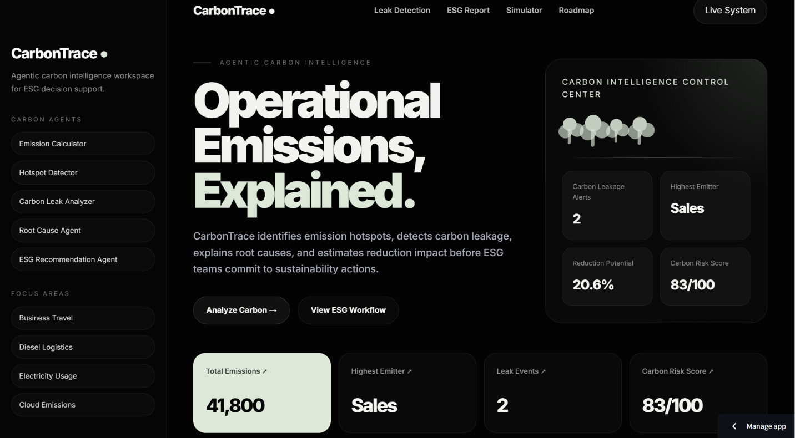
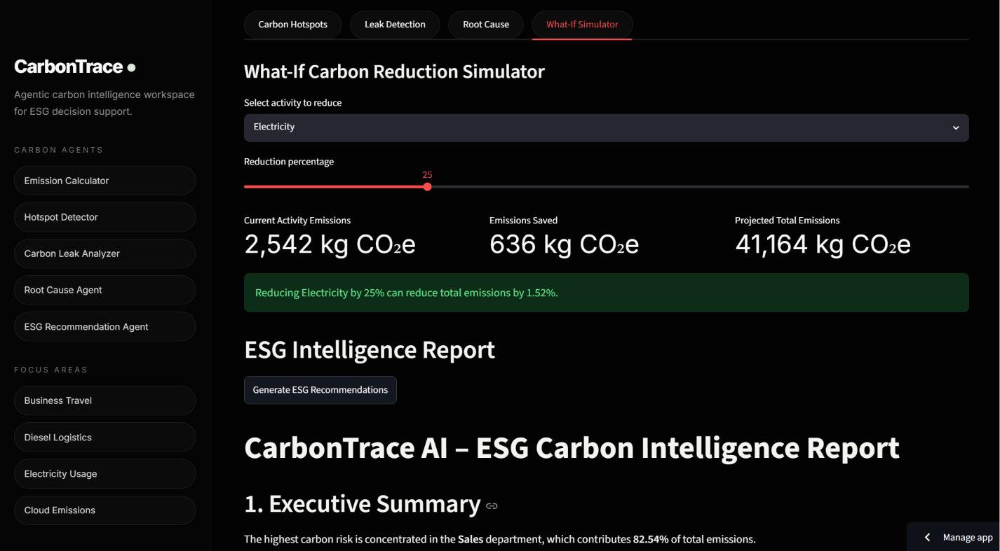
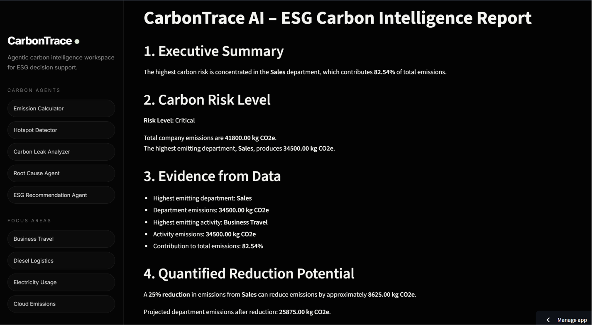

# CarbonTrace AI

Agentic Carbon Intelligence System for detecting emission hotspots, identifying carbon leakage patterns, simulating reduction strategies, and generating ESG-ready sustainability reports.

## Live Demo

Launch CarbonTrace AI:

[CarbonTrace AI Live App](carbontrace-ai-qfgkviqr6ewu5jfgtcc885.streamlit.app)

## Screenshots

### Landing Page

### Carbon Reduction Simulator

### ESG Intelligence Report

## Key Capabilities

* Carbon Emission Estimation
* Department-Level Hotspot Detection
* Carbon Leakage Analysis
* Root Cause Investigation
* What-If Reduction Simulation
* ESG Intelligence Report Generation
* Carbon Risk Scoring

## Impact Demonstrated

* Total Emissions Analyzed: **41,800 kg CO₂e**
* Highest Risk Department Identified: **Sales**
* Risk Contribution: **82.5%**
* Potential Emission Reduction: **8,625 kg CO₂e**
* Reduction Scenario Planning Enabled

## Architecture

Carbon Activity Data
↓
Emission Calculation Agent
↓
Hotspot Detection Agent
↓
Carbon Leakage Agent
↓
Root Cause Analysis Agent
↓
Reduction Simulation Engine
↓
Carbon Risk Scoring
↓
ESG Intelligence Report

## Tech Stack

* Python
* Streamlit
* Pandas
* Plotly
* Agent-Based Architecture

## Use Cases

* Corporate Sustainability Teams
* ESG Monitoring
* Carbon Accounting
* Sustainability Reporting
* Decarbonization Planning
